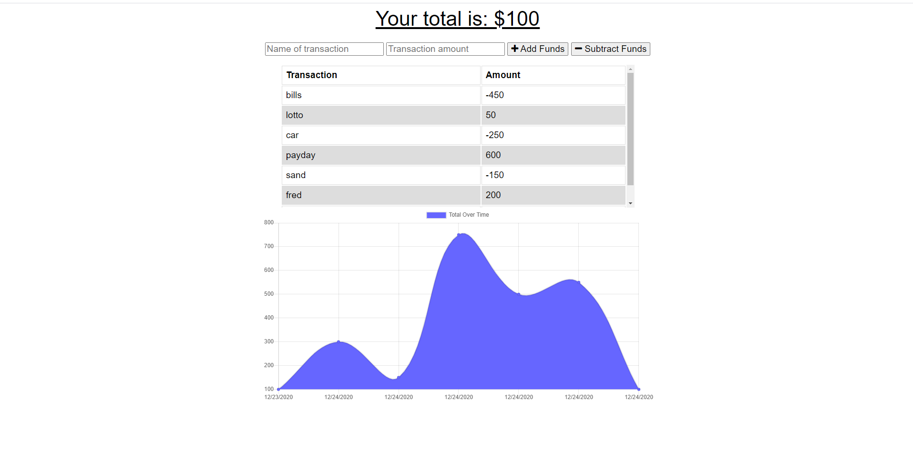

# Budget Tracker PWA

## Description: 
This is a progressive web application that allows the user to use the application even without internet connection thanks to service workers and indexedDB! This PWA is useful for keeping track of your budget by allowing users to visualize their recent transactions with an interactive graphing tool! The user may also install this app directly onto their desktop or phone!   

## Technologies Used:

* Javascript
* HTML5
* CSS3
* Mongoose ODM
* IndexedDB
* MongoDB

 

## Usage:
Checkout the deployed site at the link below!

https://cryptic-ridge-87336.herokuapp.com/
  

## Screenshot:

## License:

This project is licensed under the MIT license.
  

## Questions:

If you have any questions about the repo, open an issue or contact me directly at Jespi116@fiu.edu. you can find more of my work at [Jespi116](https://github.com/Jespi116)
